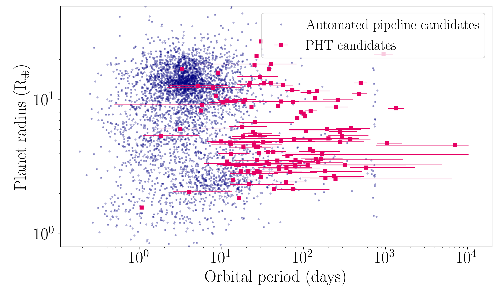
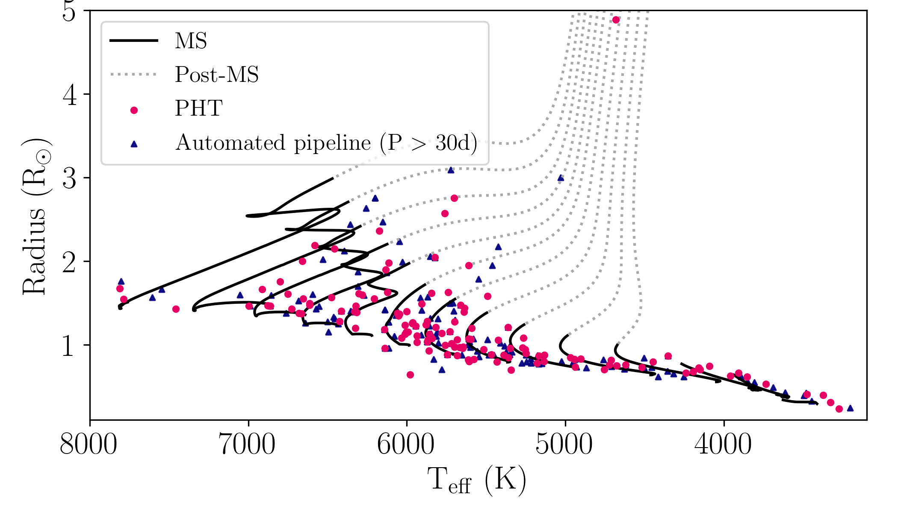
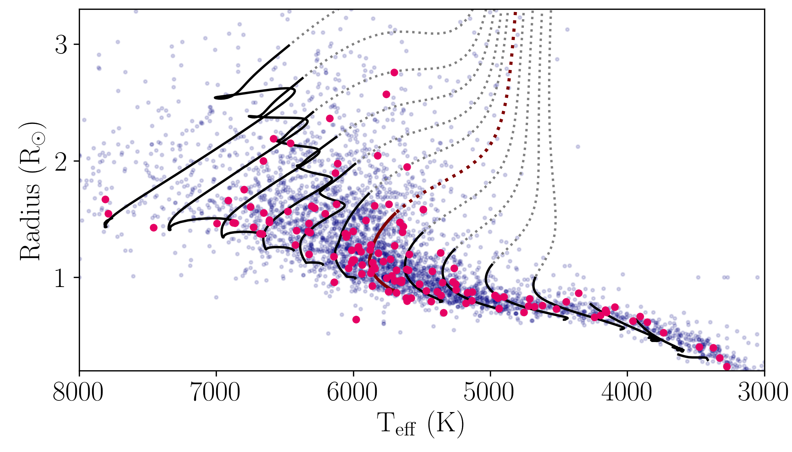
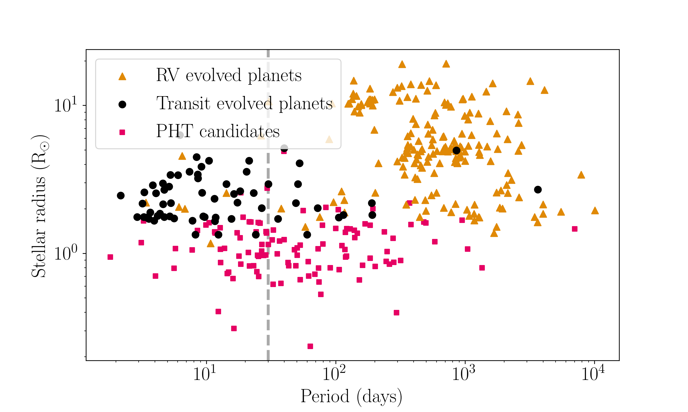

# PHT Exoplanet Candidates

Data and notebook for generating plots to examine the population of PHT planet candidates. The below plots were made using the list of TOIs as downloaded from ExoFOP on the 13th October 2021 (file: TOI_list.txt). This list can be updated at https://exofop.ipac.caltech.edu/tess/view_toi.php. The PHT planet candidates and their properties are listed in PHT_candidates_info.csv. More information on how the planet parameters were derived can be found in [Eisner et al. 2021](https://arxiv.org/abs/2011.13944). All below plots and captions were generated for PostDoc applications 2021. 

**Figure 1.** The PHT planet candidates (magenta squares) compared to the automated pipeline found candidates (blue dots), highlighting the different region of parameter space filled in by the two different search methods. Values of the orbital periods and planet radii were obtained via transit modelling using the open source software *pyaneti* (Barragan et al [2021](https://arxiv.org/abs/2109.14086), [GitHub](https://github.com/oscaribv/pyaneti)) The orbital period of single transit events are poorly constrained, which is reflected by the large errorbars.

**Figure 2.** .  Stellar evolution tracks showing MS (solid black lines) and post-MS (dashed grey lines) evolution for stellar masses ranging from 0.3 to 1.6 solar mass in steps of 0.1 solar masses (Choi et al. 2016). The PHT identified candidates are shown by magenta circles and the TESS automated pipeline candidates with periods longer than 30 days are depicted by navy triangles. This figure highlights that PHT can identify planets around subgiant stars and shows a lack of longer period pipeline identified planets.

**Figure 3.** Stellar evolution tracks showing main sequence (solid black lines) and post-main sequence (dashed grey lines) MIST stellar evolution for stellar masses ranging from 0.3 to 1.6 solar mass in steps of 0.1 solar mass. The magenta evololution track shows corresponds to 1 Solar mass. The navy dots show the TOIs and the magenta circles show the PHT candidates. This figure highlights that PHT is able to find planet candidates around stars with a wide range of properties as well as at different stages of their evololution.

**Figure 4.** The sample of confirmed exoplanets listed in the NASA Exoplanet archive highlighting the differences between the population of evolved planets detected using the transit method (black circle) and the radial velocity (RV) method (orange triangles).  The PHT planet candidates (pink squares) highlight that the citizen science approach is sensitive a period range where automated transit detection pipelines struggle (> 30 days, grey dashed line) and its ability to probe currently under-sampled period range.
